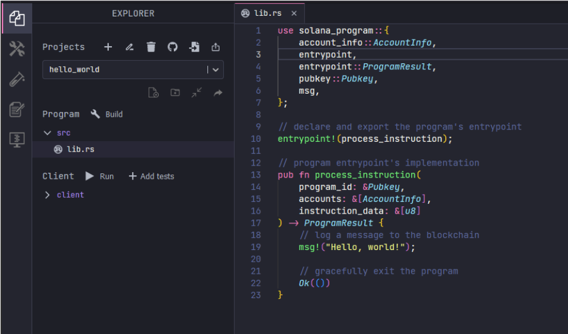

Developers looking to get into Solana development who already know Rust have a
great head start. Rust is an officially supported language for writing on-chain
programs for the Solana Blockchain. However, several key differences in the
language's usage could otherwise be confusing.

This guide will walk through several of those differences, specifically the
setup details, restrictions, macro changes, and compute limits. Additionally,
this guide will cover the development environments and frameworks needed to
start with Solana.

By the end of this guide, Rust developers will understand the differences they
need to know to start their Solana journeys.

## Understanding the Core Differences

First, note that this guide aims at understanding the differences in using Rust
as a language when working with Solana. It won’t cover
[Blockchain or Solana basics](https://solana.com/learn/blockchain-basics).

It also won’t cover core Solana concepts that must be understood in order to
program in Solana, such as:

- [Programs](https://solana.com/docs/core/programs) - Solana’s version of smart
  contracts
- [Accounts](https://solana.com/docs/core/accounts) - A record in the Solana
  ledger that either holds data (a data account) or is an executable program
- Various [fees](https://solana.com/docs/core/fees#why-pay-transaction-fees) -
  Such as base fee, priority fee, and rent
- [Transactions](https://solana.com/docs/core/transactions) - Interactions with
  the network that contain instructions, signatures, and more.

For more information on those core concepts, check out the
[Solana developer documentation](https://solana.com/developers).

Let’s now look at the differences in **project setup**.

## Key Setup Details

On-chain programs for Solana in Rust are still Rust programs at heart. They
still follow the standard Rust project with a `/src` folder and `Cargo.toml`
file in the root. That said, there are several key differences.

### Project Dependencies

To get started, the
[solana-program crate](https://crates.io/crates/solana-program) is required for
every on-chain Solana program written with Rust. This is the base library for
all on-chain Rust programs. The library defines macros for the required
**program entrypoint** _(see below)_, **core data types**, **logging macros**,
and more.

### Program Entrypoint

Instead of a `main` function, Solana programs use the `entrypoint!` macro. This
symbol is exported and then called by the Solana runtime when the program runs.
The entrypoint macro calls a given function, which must have the following type
signature:

```rust
pub fn process_instruction( program_id: &Pubkey, accounts: &[AccountInfo],
instruction_data: &[u8], ) -> ProgramResult {

        //program code goes here

    }
```

These three parameters are passed to every on-chain program.

1. The `program_id` is the public key of the current program.
2. The `accounts` are all accounts that are required to process the instruction.
3. The `instruction_data` is data specific to that instruction.

Every program must then call the `entrypoint!` macro on the instruction, as
follows:

```rust
entrypoint!(process_instruction);
```

### Building and Testing

After installing the Solana command-line tools, projects can be built to target
host machines as normal with `cargo build`.

However, to target the Solana runtime, use `cargo build-bpf` or
`cargo build-spf` which will compile the program to the bytecode necessary to
run it on the Solana runtime.

Unit testing can be achieved via `cargo test` with standard `#test` attributes.
For more integrated testing, the
[solana-program-test](https://crates.io/crates/solana-program-test) crate
provides a local Solana runtime instance which can be used in conjunction with
outside tests sending transactions.

Finally, a full test cluster can be started with the
[solana-test-validator](https://docs.solanalabs.com/cli/examples/test-validator),
installed along with the Solana CLI. This creates a fully featured test cluster
on a local machine, which can then deploy programs and run tests.

## Understanding Restrictions

While most standard Rust crates are available in the Solana runtime, and
third-party crates are supported as well, there are several limitations. Since
the Solana runtime has resource constraints and must run deterministically, here
are the differences to be aware of:

### Package Limitations

The following packages are unavailable: rand

- std::fs
- std::net
- std::future
- std::process
- std::sync
- std::task
- std::thread
- std::time

The following packages have limited functionality:

- std::hash
- std::os

### Rand Dependencies

Because programs must run deterministically, the `rand` crate is not available.
Using an additional crate that depends on `rand` will also cause compile errors.

However, if the crate used simply depends on `rand` but does not actually
generate random numbers, then it is possible to work around this by adding the
following to the program’s Cargo.toml:

```toml
[dependencies]
getrandom = { version = "0.1.14", features = ["dummy"] }
```

### Macro Changes

Several standard macros have been replaced or have modified behavior to be aware
of. First, the `println!` has been replaced with the computationally simpler
`msg!` macro. The `msg!` macro outputs to the program logs, and it can be used
as follows:

```rust
msg!(“Your message”);
msg!(0_64, 1_64, 2_64);
msg!(“Your variable: {:?}”, variable);
```

The `panic!`, `assert!`, and any internal panics are also output to the program
logs by default. However, this can be modified with a custom panic handler.

## Compute Budget

As a Rust developer, efficient computing is nothing new. What may be different
is that in Solana, each transaction has a fixed
[compute budget](https://solana.com/docs/core/runtime#compute-budget) that it
must not surpass. When transactions exceed the compute budget, they are halted
and return an error.

Programs can access the number of remaining compute units via the
`sol_remaining_compute_units` system call, and can log the remaining number of
compute units with `sol_log_compute_units`.

## Learning the Development Environment and Frameworks

While the Solana CLI and the `solana_program` crate are all that is needed to
get started, there are a couple of helpful tools which can accelerate learning.

<div align="center">
    
</div>

### Solana Playground

The [Solana Playground](https://beta.solpg.io/) is a browser-based IDE that
allows developers to develop and deploy Solana programs.

<div align="center">
    
</div>

It’s the easiest way to begin developing with Solana, and it supports building,
testing, and deploying Solana Rust programs. Additionally, a number of built-in
tutorials are available to guide learning.

The Solana Playground allows developers to get started immediately without
setting up a local environment.

### Using Anchor

[Anchor](https://www.anchor-lang.com/) is a framework that seeks to accelerate
the building of secure Solana programs. It can help by handling standard
boilerplate code, speeding up the development cycle. Additionally, it provides
some security checks by default, making Solana programs more secure.

To create a new program, simply create a new Anchor project in the Solana
playground.

Alternatively, install the Anchor CLI locally, and then use
`anchor init <project-name>` to create a new Anchor project.

## Creating Off-chain Programs

So far, this guide has covered the key details of developing **on-chain Solana
programs** in Rust. However, it’s also possible to develop **off-chain Solana
clients** in Rust. This can be done by using the
[solana_sdk crate](https://docs.rs/solana-sdk/latest/solana_sdk/). This contains
the [solana_client crate](https://docs.rs/solana-client/latest/solana_client/)
that allows Rust programs to interact with a Solana node via the JSON RPC API.

Another option is to use the
[anchor_client crate](https://docs.rs/anchor-client/latest/anchor_client/) which
interacts with Solana programs written in Anchor via RPC. Alternatively,
consider writing on-chain programs in Rust, and off-chain clients in JS/TS.

## Wrap Up

This guide has covered the basics of developing for Solana with Rust, from setup
details and restrictions to development environments and frameworks.

For more Rust-related Solana resources, check out the
[Developing with Rust page](https://solana.com/docs/programs/lang-rust). And for
other Solana program examples written with Rust, check out these
[examples on GitHub](https://github.com/solana-labs/solana-program-library/tree/master/examples/rust).
